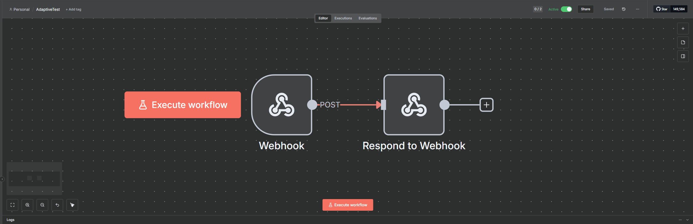
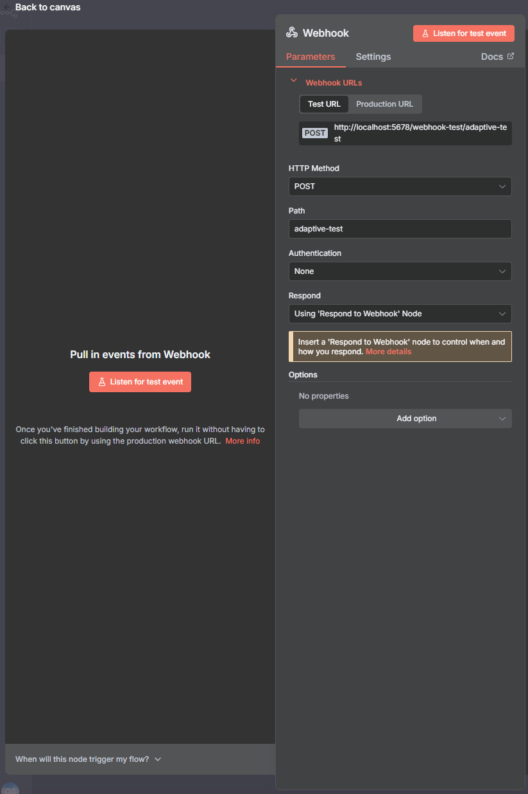
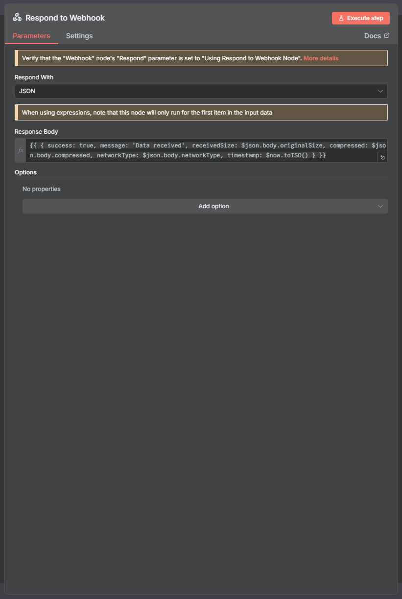

# n8n AdaptiveTest Workflow: Network Adaptation & Diagnostics

This document outlines the steps to create and configure the n8n workflow for the Unity **AdaptiveTest.cs** example. This minimal setup allows the Unity client to test network connectivity, adaptive data compression, and receive diagnostic information based on current network conditions.

## Workflow Overview

The final workflow structure is a simple chain of **two nodes**. Its purpose is to receive the request data sent from Unity and immediately return a structured JSON response that echoes key diagnostic fields.

| Node | Purpose |
| :--- | :--- |
| **Webhook** | Serves as the entry point, receiving JSON data and optional binary files sent from the Unity client. |
| **Respond to Webhook** | Constructs the final success response, including crucial diagnostic data like the original data size, compression status, and reported network type. |

### Final Workflow Structure

The simplest functional structure for receiving data and returning a result immediately:

\![Adaptive Test Workflow Structure - Webhook connected to Respond to Webhook]

-----

## Part 1: n8n Node Configuration

Follow these steps to configure each node in your n8n canvas.


### 1\. Webhook Node (Entry Point)

This node generates the production URL that the Unity client will call.

  - **HTTP Method**: `POST`
  - **Path**: `adaptive-test` (This **must** match the `uploadEndpoint` field in the Unity **AdaptiveTest.cs** script).
  - **Authentication**: `None`
  - **Respond**: `Using 'Respond to Webhook' Node` (This ensures the output of the next node is sent back as the final response).

-----

### 2\. Respond to Webhook Node (Exit Point)

This is the critical step for diagnostics. The node immediately returns a JSON response to the Unity client. The response body uses an expression to extract and echo key diagnostic fields (`originalSize`, `compressed`, `networkType`) that the Unity client includes in its request body.

  - **Respond With**: `JSON`
  - **Response Body**: Use the following **expression**. The fields `originalSize`, `compressed`, and `networkType` are dynamically read from the incoming data (`$json.body`) sent by the Unity `AdaptiveTest.cs` script.

<!-- end list -->

```
={{ { success: true, message: 'Data received', receivedSize: $json.body.originalSize, compressed: $json.body.compressed, networkType: $json.body.networkType, timestamp: $now.toISO() } }}
```

-----

## Part 2: How to Use with the Unity Example

This setup validates that the **Automation Tool's** client (`AutomationClient.cs`) is correctly integrating `NetworkMonitor` data into the request metadata and handling adaptive compression (GZIP) when requested.

### Prerequisites

✅ You have n8n running locally (e.g., via Docker).

✅ The **Base URL** in your Unity **AutomationConfig.asset** points to your n8n instance (typically `http://localhost:5678`).

✅ The feature flags `enableCompression` and `enableNetworkMonitor` are set to `true` in your Unity `AutomationConfig.asset` (e.g., `AdaptativeTest.asset`).

### Instructions

#### Step 1: Run n8n Workflow

1.  Import the provided workflow file: **AdaptiveTest.json**.
2.  **Activate it** by toggling the "Active" switch to **ON**.

#### Step 2: Run Unity Scene

1.  Open the scene: `Assets/Automation Tool/Examples/Scenes/AdaptiveTest.unity`.
2.  Press the **Play** button. Wait for the initialization status to display **"Network Adaptation Test Ready\!"**.

#### Step 3: Trigger the Tests

The interface allows you to test the adaptive logic:

| Test Button | C\# Method | Rationale | Expected Console Output |
| :--- | :--- | :--- | :--- |
| **Send Small Data** | `OnSendSmallData()` | Sends a 1KB payload with compression explicitly **DISABLED** (`compress: false`). | `SUCCESS: Small data delivered...` (Check n8n execution output for `compressed: false`). |
| **Send Large Data** | `OnSendLargeData()` | Sends a 1MB payload. Compression is decided by the `NetworkMonitor.ShouldCompressData()` method (ON for Cellular/Poor Network, OFF for WiFi/Good Network). | `SUCCESS: Large data delivered...` (Check n8n output for the decision: `compressed: true` or `false`). |
| **Measure Latency** | `OnMeasureLatency()` | Forces an immediate latency check against the configured `pingEndpoint` and updates the UI/Logs. | `Latency measured: Xms. Category: [Good/Fair/Poor]`. |
| **Check Conditions** | `OnCheckConditions()` | Logs a full diagnostic report on connectivity, battery status, and sends back the system's current recommendations (e.g., `Should Defer Operations: Yes`). | Detailed log output with network type and performance recommendations. |

### Expected Success Response in n8n

A successful execution will show that the **Respond to Webhook** node returned the expected structured data, confirming that Unity successfully embedded all diagnostic metadata into the request body:

```json
// Example Output from Respond to Webhook (after sending Large Data on a Cellular connection)
{
  "success": true,
  "message": "Data received",
  "receivedSize": 1048576,
  "compressed": true,
  "networkType": "Cellular",
  "timestamp": "2025-10-17T16:00:00.000Z"
}
```