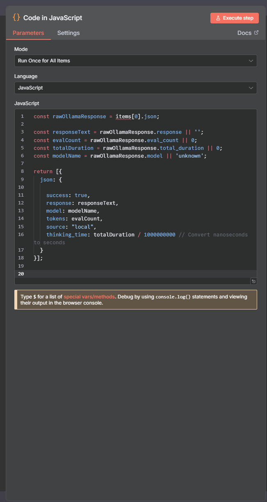

# n8n AI Chat Assistant Workflow (Ollama / LocalAI)

This document provides a complete guide to create and configure the n8n workflow that connects the Unity AI Chat Assistant with an external Large Language Model (LLM) service.

This specific workflow is designed to connect to local LLM services like **Ollama** or **LM Studio** using their standard API endpoint (`http://127.0.0.1:11434/api/generate`).

---

## Workflow Overview

The final workflow structure is composed of **four nodes**:

1. **Webhook**: Receives the user's message, system prompt, and chat history from the Unity client via an HTTP POST request.

2. **HTTP Request**: Forwards the combined chat payload (prompt + history) to the local LLM's API endpoint (e.g., Ollama).

3. **Code in JavaScript**: Parses, cleans, and formats the raw AI response into the structured `AIResponse` object expected by the Unity client.

4. **Respond to Webhook**: Sends the final, structured JSON response back to the Unity client.


---

## Part 1: n8n Node Configuration

Follow these steps to configure each node in your n8n canvas.

### 1. Webhook Node (Entry Point)

This node generates the URL that the Unity client will call.

- **HTTP Method**: `POST`
- **Path**: `ai-chat` (This must match the `aiChatWebhook` field in the Unity `ArtificialIntelligenceExample.cs` script)
- **Authentication**: `None`
- **Respond**: `Using 'Respond to Webhook' Node` (This links the response back to Unity through the final node)


---

### 2. HTTP Request Node (Connect to LLM)

This node sends the actual request to your locally running LLM API (e.g., Ollama or LM Studio).

- **Method**: `POST`
- **URL**: `http://127.0.0.1:11434/api/generate` (⚠️ **ACTION REQUIRED**: Change this to `PUT_YOUR_LLM_API_ENDPOINT_HERE` if you are using a non-default setup)
- **Send Body**: ✓ (ON)
- **Specify Body**: `JSON`

#### JSON Body (Expression)

The following expression constructs the prompt and selects the model based on the `provider` field sent from Unity.

```json
{
  "model": "{{ $json.body.provider === 'localai' ? 'PUT_YOUR_LOCALAI_MODEL_HERE' : 'PUT_YOUR_OLLAMA_MODEL_HERE' }}",
  "prompt": "{{ $json.body.systemPrompt }}\n\nUser: {{ $json.body.message }}\nAssistant:",
  "stream": false,
  "options": {
    "temperature": 0.7,
    "num_ctx": 4096
  }
}
```

⚠️ **ACTION REQUIRED**: Replace `PUT_YOUR_LOCALAI_MODEL_HERE` and `PUT_YOUR_OLLAMA_MODEL_HERE` with the actual model names you have loaded (e.g., `deepseek-r1:14b` or `llama2`).


---

### 3. Code in JavaScript Node (Parser)

This node is **CRUCIAL** for cleaning the raw LLM response into the exact JSON structure (`AIResponse` class) that the Unity client expects to deserialize.

- **Mode**: `Run Once for All Items`
- **Language**: `JavaScript`

#### JavaScript Code

```javascript
const rawOllamaResponse = items[0].json;

// Extract and clean necessary fields expected by Unity's AIResponse class.
const responseText = rawOllamaResponse.response || '';
const evalCount = rawOllamaResponse.eval_count || 0;
const totalDuration = rawOllamaResponse.total_duration || 0;
const modelName = rawOllamaResponse.model || 'unknown';

return [{
  json: {
    // These are the only fields the C# 'AIResponse' class expects.
    success: true,
    response: responseText,
    model: modelName,
    tokens: evalCount,
    source: "local",
    thinking_time: totalDuration / 1000000000 // Convert nanoseconds to seconds
  }
}];
```



---

### 4. Respond to Webhook Node (Exit Point)

This node delivers the final, clean JSON back to the Unity client.

- **Respond With**: `JSON`
- **Response Body**: `={{ $json }}` (⚠️ **CRITICAL**: This ensures the response contains only the clean JSON created in the previous node)


---

## Part 2: How to Use with the Unity Example

### Prerequisites

✅ You have n8n running locally (e.g., via Docker or the Desktop App).

✅ Your local LLM service (Ollama, LM Studio, etc.) is running and accessible at the configured URL.

✅ The **Base URL** in your Unity `ArtificialIntelligenceConfig.asset` points to your n8n instance (typically `http://localhost:5678`).

### Instructions

#### Step 1: Run n8n Workflow

1. Build the workflow in n8n as described in **Part 1**.
2. Save the workflow and **activate it** by toggling the "Active" switch to **ON**.

#### Step 2: Run Unity Scene

1. Open the `ArtificialIntelligenceExample.unity` scene.
2. Press the **Play** button.

#### Step 3: Chat

1. Type a message (e.g., *"Tell me a fun fact about Unity"*) in the input field and press **Send**.

---

## Part 3: Check the Result

### Expected Behavior

1. The Unity **Status Text** will change to `AI is thinking...`.
2. The n8n workflow executes, calling your local LLM model.
3. The AI's final response will appear in the main chat area in Unity.
4. The console log will show a line similar to:

```
[AIExample] AI Response received - Model: PUT_YOUR_MODEL_HERE, Tokens: 123 - Time: 1.56s
```

### Verify in n8n

You can also check the **Executions** tab in n8n to see:
- The incoming request from Unity
- The response from your LLM
- The formatted output sent back to Unity


---

## Troubleshooting

### Common Issues

| Problem | Solution |
|---------|----------|
| **Unity cannot connect to n8n** | Verify n8n is running and the Base URL in Unity matches your n8n instance (usually `http://localhost:5678`). |
| **"Model not found" error** | Replace `PUT_YOUR_MODEL_HERE` in the HTTP Request node with an actual model name from your LLM service. |
| **No response from LLM** | Check that your local LLM service (Ollama/LM Studio) is running and accessible at the configured URL. |
| **Unity deserialization error** | Verify the Code node output matches the Unity `AIResponse` class structure exactly. |

---

## Notes

- The workflow path `/ai-chat` must match the webhook endpoint configured in your Unity script.
- The JavaScript parser assumes the Ollama API response format. If using a different LLM service, adjust the parsing logic accordingly.
- For production use, consider adding error handling and authentication to the webhook.

---

## Additional Resources

- [n8n Documentation](https://docs.n8n.io/)
- [Ollama Documentation](https://ollama.ai/)
- [Unity WebRequest Documentation](https://docs.unity3d.com/ScriptReference/Networking.UnityWebRequest.html)