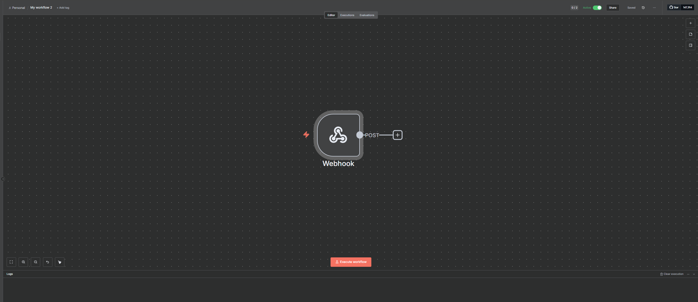
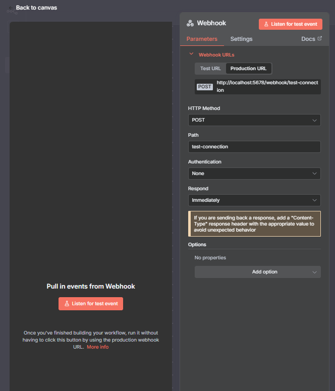
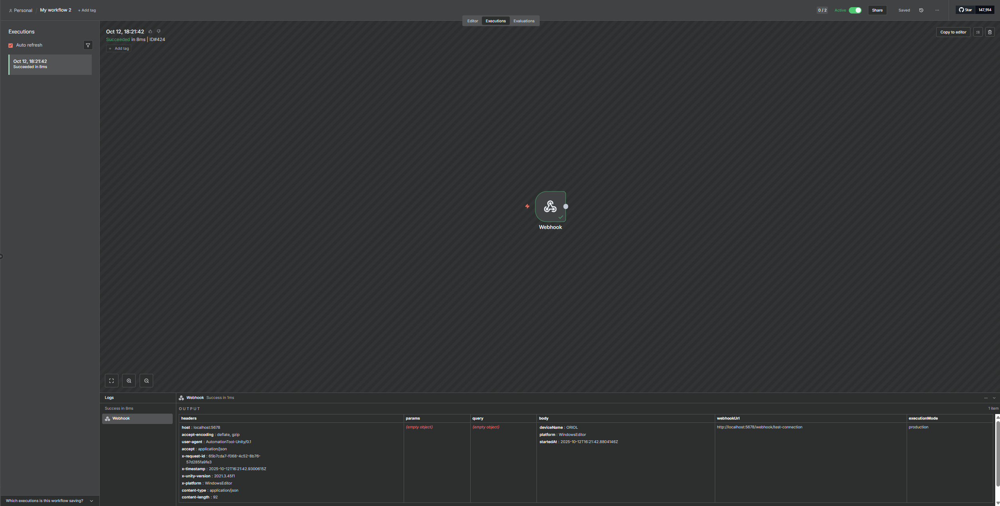

# n8n Webhook Test Connection

This document outlines how to create a simple n8n workflow to verify that your Unity client can successfully send data to your n8n instance. This is a fundamental first step before building more complex workflows.

## Workflow Overview

The workflow consists of a single **Webhook** node. Its only job is to listen for an incoming HTTP `POST` request and log a successful execution. If the workflow runs, it confirms that the network connection and basic configuration are correct.

The final structure is as simple as possible:

---

## 1. n8n Node Configuration

Follow these steps to configure the Webhook node in your n8n canvas.

### Webhook Node

This node will generate a URL that listens for incoming `POST` requests. In the context of the `Automation Tool`, this is the endpoint that the `ExampleUsage.cs` script will call to test the connection.

- **HTTP Method**: `POST`
- **Path**: `test-connection`
- **Authentication**: `None`
- **Respond**: `Immediately`

---

## 2. How to Use with the Unity Example

This test workflow is designed to be used with the `ExampleUsage` scene provided in the Unity "Automation Tool" asset.

### Step 1: Run the n8n Workflow

1.  Create the workflow in n8n as described above.
2.  Save the workflow and **activate it** by toggling the "Active" switch to **ON**. The workflow is now listening for events.

### Step 2: Configure and Run the Unity Scene

1.  In the Unity Editor, open the following scene: `Assets/Automation Tool/Examples/Scenes/ExampleUsage.unity`.
2.  In the scene Hierarchy, ensure the `[AutomationManager]` prefab is present. The `AutomationConfig` asset it uses is pre-configured to connect to `http://localhost:5678`, which is the default address for a local n8n instance.
3.  Press the **Play** button in the Unity Editor.

### Step 3: Trigger the Connection Test

1.  As soon as the scene starts, the `ExampleUsage.cs` script will automatically try to initialize the system.
2.  Once initialized, it calls the `SendGameStartedEvent()` function.
3.  This function sends a `POST` request containing device information to the `test-connection` webhook endpoint you just configured.

---

## 3. Check the Result

If the connection is successful, you will see a new entry in the **Executions** tab of your n8n workflow.

- The execution will be marked as "Succeeded".
- Clicking on the execution will show you the data that was received from Unity in the "body" section of the output, confirming that your setup is working correctly.

