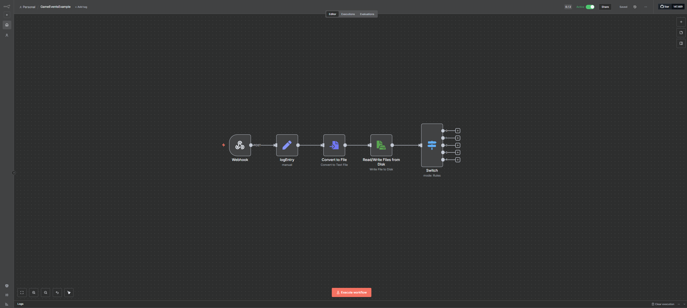
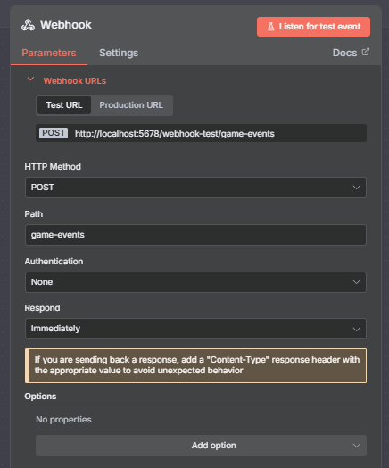
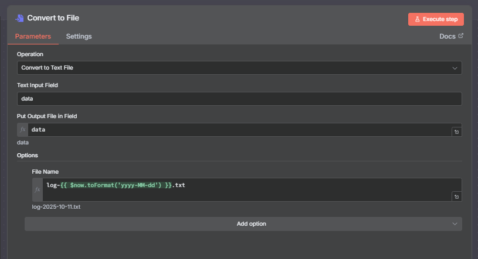
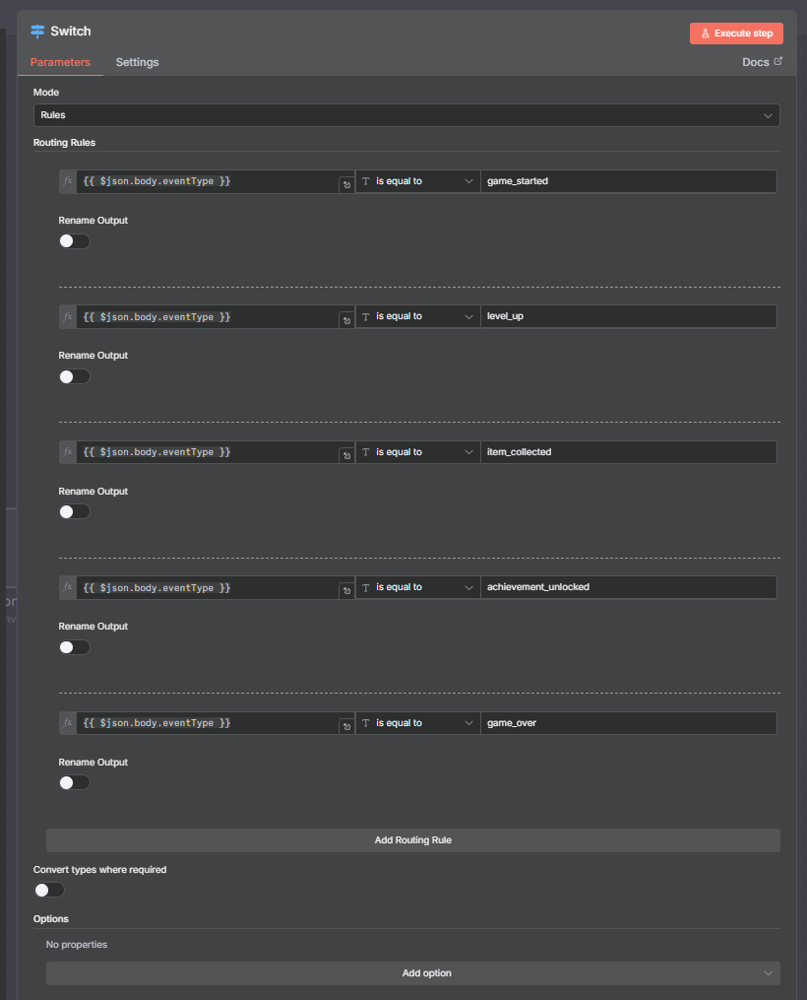

# n8n Game Event Logger and Router

This document outlines the steps to create an n8n workflow that listens for game events sent from a Unity client, logs each event to a daily file, and then routes the workflow based on the type of event received.

## Workflow Overview

The final workflow will look like this:



It consists of the following nodes:
1.  **Webhook**: Receives game data from the Unity client via an HTTP `POST` request.
2.  **logEntry (Set Node)**: Formats the received data into a log string with a timestamp.
3.  **Convert to File**: Converts the log string into a file object that can be saved to disk.
4.  **Read/Write Files from Disk**: Appends the log entry to a file on the local disk. A new log file is created for each day.
5.  **Switch**: Routes the execution flow based on the `eventType` received from Unity (e.g., `game_started`, `level_up`, etc.).

---

## Part 1: n8n Node Configuration

Follow these steps to build the workflow in your n8n canvas.

### 1. Webhook Node

This node is the entry point for your data. It will generate a URL to receive HTTP `POST` requests from the Unity client.

- **HTTP Method**: `POST`
- **Path**: `game-events`
- **Authentication**: `None`
- **Respond**: `Immediately`



### 2. logEntry (Set Node)

This node prepares the incoming data for logging by creating a timestamped string.

- **Mode**: `Manual Mapping`
- **Fields to Set**:
    - Create a field named `data` of type `String`.
    - Set its value using the following **expression**:
      ```
      {{ $now.toISO() }} - Received Event: {{ JSON.stringify($json.body) }}\n
      ```
      This expression prepends the current timestamp to the full JSON body of the received event and adds a newline character.


### 3. Convert to File Node

This node converts the `data` string created in the previous step into a binary file object that can be written to disk.

- **Operation**: `Convert to Text File`
- **Text Input Field**: `data`
- **Put Output File in Field**: `data`
- **Options**:
    - **File Name**: Use the following **expression** to create a dynamic file name based on the current date.
      ```
      log-{{ $now.toFormat('yyyy-MM-dd') }}.txt
      ```



### 4. Read/Write Files from Disk Node

This node takes the file object and appends its content to a log file on the computer where n8n is running.

- **Operation**: `Write File to Disk`
- **File Path and Name**: Use the following **expression**.
  - **Important**: Replace `USE_YOUR_USERNAME_HERE!!!` with your actual Windows username. Make sure the output directory (e.g., `C:\Users\YOUR_USERNAME\Documents\n8noutput`) exists, or change the path to a directory of your choice.
    ```
    {{ "C:\\Users\\USE_YOUR_USERNAME_HERE!!!\\Documents\\n8noutput\\log-" + $now.toFormat('yyyy-MM-dd') + ".txt" }}
    ```
- **Input Binary Field**: `data`
- **Options**:
    - **Append**: Turn this option **ON**. This is crucial for adding new logs to the file without overwriting existing ones.


### 5. Switch Node

This node directs the workflow to different branches based on the event type sent from Unity. It acts as a router.

- **Mode**: `Rules`
- **Routing Rules**: Create a rule for each event type. The value for each rule should be an **expression** that reads the `eventType` from the incoming JSON data.
    - **Expression**: `{{ $json.body.eventType }}`

- **Setup the following routing rules**:
    - is equal to `game_started`
    - is equal to `level_up`
    - is equal to `item_collected`
    - is equal to `achievement_unlocked`
    - is equal to `game_over`



After the Switch node, you can add other nodes to each output to handle the specific logic for each event type (e.g., send a Discord message for an achievement, update a database when the game is over, etc.).

---

## Part 2: How to Use with the Unity Example

This workflow is designed to be used with the included Unity example scene.

### Prerequisites

* You have n8n running locally.
* You have a Unity project with the "Automation Tool" asset imported.

### 1. Run the n8n Workflow

1.  Build the workflow in n8n as described in the "Node Configuration" section.
2.  **Important**: Make sure you have created the output directory (e.g., `C:\Users\YOUR_USERNAME\Documents\n8noutput`) specified in the "Read/Write Files from Disk" node.
3.  Save the workflow and **activate it** by toggling the "Active" switch to **ON**. The workflow is now listening for events on its production URL.

### 2. Configure and Run the Unity Scene

1.  In the Unity Editor, open the following scene: `Assets/Automation Tool/Examples/Scenes/GameEventExampleScene.unity`.
2.  In the scene Hierarchy, ensure the `[AutomationManager]` prefab is present. Its configuration should already be linked to the `ExampleAutomationConfig` asset, which is pre-configured to connect to `http://localhost:5678`.
3.  Select the `[GameEventsManager]` GameObject in the Hierarchy. In the Inspector, you will see the `Game Events Example` script. Confirm that the `Game Events Webhook` field is set to `game-events`, which matches the `Path` you configured in the n8n Webhook node.
4.  Press the **Play** button in the Unity Editor.

### 3. Triggering Events

1.  When the scene is running, you will see a simple UI in the Game view with several buttons.
2.  Click the **"Start Game"** button first.
3.  Then, click the other buttons like **"Level Up"**, **"Collect Item"**, **"Unlock Achievement"**, and **"Game Over"**.
4.  The "StatusText" on the UI will provide feedback on whether the event was sent successfully.

### 4. Check the Result

1.  Each time you click a button, the Unity scene sends an event to your n8n webhook.
2.  Navigate to the directory you configured in the "Read/Write Files from Disk" node (e.g., `C:\Users\YOUR_USERNAME\Documents\n8noutput`).
3.  You will find a log file named `log-YYYY-MM-DD.txt`.
4.  Open the file. It will contain timestamped entries for each game event you triggered from Unity. The content will look like this:
    ```log
    2025-10-11T18:30:00.123Z - Received Event: {"eventType":"game_started","playerId":"...","playerName":"..."}
    2025-10-11T18:30:05.456Z - Received Event: {"eventType":"level_up","playerId":"...","newLevel":2}
    ```
5.  You can also check the **Executions** tab in your n8n workflow to see a visual history of each time the workflow ran.