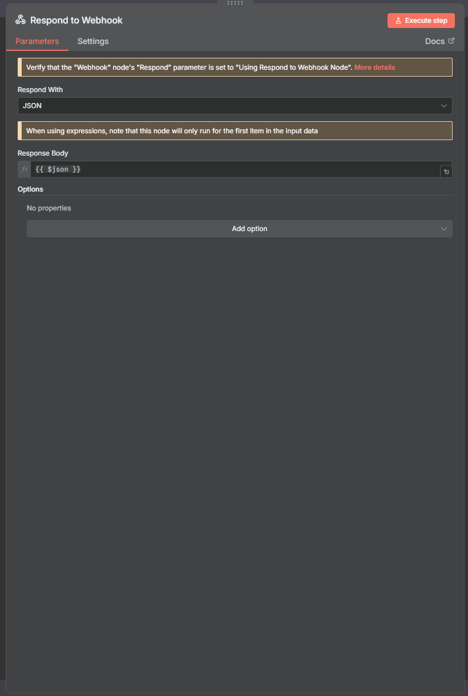

# n8n Resilience and Persistence Test Workflow

This document outlines the configuration steps for the n8n workflow used with the Unity **ResilienceTest.cs** example. This setup demonstrates how the **Automation Tool's RequestQueue** handles critical, normal, and low-priority requests even when the network connection is intentionally lost.

## Workflow Overview

The primary purpose of this minimal workflow is to act as three distinct, immediately-responding endpoints for critical, normal, and low-priority requests. This allows the Unity client to test the following:

1. **Offline Queuing**: When n8n is stopped (simulating network failure), requests fail immediately and are added to the persistent queue in Unity.
2. **Priority Handling**: The queue correctly sorts and flushes requests based on their set priority (`Critical`, `Normal`, `Low`).
3. **Intelligent Retry**: Requests successfully complete when the n8n workflow is reactivated (simulating network recovery).

The workflow consists of **three pairs of Webhook and Respond to Webhook nodes** linked sequentially:

| Endpoint | Path | Priority Tested |
| :--- | :--- | :--- |
| **Webhook** | `critical-data` | **Critical** (`RequestPriority.Critical`) |
| **Webhook1** | `game-event` | **Normal** (`RequestPriority.Normal`) |
| **Webhook2** | `analytics` | **Low** (`RequestPriority.Low`) |

### Final Workflow Structure

The workflow is a linear chain, with each `Webhook` connected directly to its corresponding `Respond to Webhook` node.


---

## Part 1: n8n Node Configuration

The configuration is identical for all three pairs, only changing the `Path` to match the Unity C# script (`ResilienceTest.cs`).

### 1. Webhook Node (`Webhook`, `Webhook1`, `Webhook2`)

This node serves as the entry point for each priority level.

- **HTTP Method**: `POST`
- **Path**:
    * **Webhook**: `critical-data`
    * **Webhook1**: `game-event`
    * **Webhook2**: `analytics`
- **Authentication**: `None` (Default)
- **Respond**: `Using 'Respond to Webhook' Node`

#### Webhook Configuration (critical-data)


#### Webhook1 Configuration (game-event)


#### Webhook2 Configuration (analytics)


### 2. Respond to Webhook Node (`Respond to Webhook`, `Respond to Webhook1`, `Respond to Webhook2`)

This node immediately sends the received body back to the Unity client as a successful response, ensuring the connection is quickly closed.

- **Respond With**: `JSON`
- **Response Body**: `={{ $json }}`



---

## Part 2: How to Use with the Unity Example

### Prerequisites

✅ You have n8n running locally (e.g., via Docker or the Desktop App).  
✅ The **Base URL** in your Unity **AutomationConfig.asset** points to your n8n instance (typically `http://localhost:5678`).

### 1. Run the n8n Workflow

1. Import the provided workflow file: **Resilience Test.json**.
2. **Activate it** by toggling the "Active" switch to **ON**.

### 2. Run the Unity Scene

1. Open the scene: `Assets/Automation Tool/Examples/Scenes/ResilienceTest.unity`.
2. Press the **Play** button. The script **ResilienceTest.cs** will wait for the system to initialize.

### 3. Execution Steps

The **ResilienceTest.cs** script is designed to be run in three distinct steps:

| Step | Action | Expected Result (n8n OFF) | Expected Result (n8n ON) |
| :---: | :--- | :--- | :--- |
| **Simulate Offline** | **1. Simulate Offline Events** (Button/Context Menu) | Requests fail instantly and are added to the **Queue**. | Requests succeed instantly and are **NOT** queued. |
| **Check Persistence** | **2. Check Queue Status** (Button/Context Menu) | The console shows **3 requests** in the queue, ordered by **Priority** (`Critical`, `Normal`, `Low`). | N/A |
| **Simulate Recovery** | **3. Manual Flush Queue** (Button/Context Menu) | The requests are sent to n8n in **Priority Order** (`Critical` first), cleared from the queue, and executed in n8n. | N/A |

---

## Part 3: Configuration Summary (ResilienceTest.cs)

The `ResilienceTest.cs` script utilizes `RequestData` objects with customized priorities and max retries to demonstrate resilience:

| Event | Endpoint | Priority | Max Retries |
| :--- | :--- | :--- | :--- |
| **Critical** (`player_death`) | `critical-data` | `RequestPriority.Critical` (0) | 3 |
| **Normal** (`level_start`) | `game-event` | `RequestPriority.Normal` (2) | 3 |
| **Low** (`analytics`) | `analytics` | `RequestPriority.Low` (3) | 1 |

---

## Testing the Workflow

### Simulating Network Failure

To test the resilience features:

1. **Start with n8n active**: Run the Unity scene with the workflow active. All requests should complete successfully.
2. **Stop the workflow**: Toggle the "Active" switch in n8n to **OFF** (or stop your n8n instance entirely).
3. **Trigger events in Unity**: Use the buttons or context menu to trigger the three test events. You'll see error messages in the Unity console as requests fail.
4. **Check the queue**: Use the "Check Queue Status" button to verify all three requests are queued and ordered by priority.
5. **Restart the workflow**: Reactivate the workflow in n8n.
6. **Flush the queue**: Use the "Manual Flush Queue" button in Unity to send the queued requests. They should complete successfully in priority order.

### Expected Console Output

When running offline tests, you should see output similar to:
```
[RequestQueue] Request failed, adding to queue: critical-data (Priority: Critical)
[RequestQueue] Request failed, adding to queue: game-event (Priority: Normal)
[RequestQueue] Request failed, adding to queue: analytics (Priority: Low)
[RequestQueue] Queue Status: 3 requests pending
[RequestQueue] Flushing queue...
[RequestQueue] Sending queued request: critical-data (Priority: Critical) - Success!
[RequestQueue] Sending queued request: game-event (Priority: Normal) - Success!
[RequestQueue] Sending queued request: analytics (Priority: Low) - Success!
[RequestQueue] Queue flushed: 3 requests completed
```

---

## Workflow Import File

Use the provided **Resilience Test.json** file to import this workflow directly into your n8n instance. The workflow is pre-configured with all necessary nodes and connections.