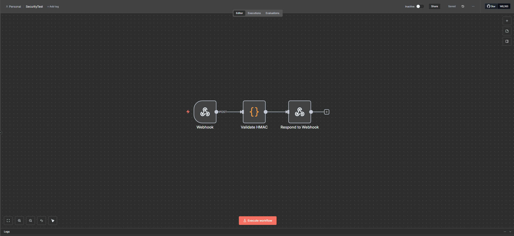

# n8n HMAC Security Test Workflow

This document outlines the configuration steps for the n8n workflow used with the Unity **SecurityTest.cs** example. This workflow demonstrates **cryptographic request signing** using **HMAC-SHA256** to ensure data integrity and authenticity between Unity and n8n.

## Workflow Overview

The primary purpose of this workflow is to validate that requests sent from Unity have not been tampered with during transit. It demonstrates:

1. **Request Signing**: Unity generates an HMAC-SHA256 signature of the request body using a shared secret key.
2. **Server-Side Validation**: n8n receives the request, regenerates the signature using the same secret, and compares it with the received signature.
3. **Tamper Detection**: If the signatures don't match, the request is rejected, indicating potential data manipulation.

The workflow consists of **three nodes in a linear chain**:

| Node | Purpose |
| :--- | :--- |
| **Webhook** | Receives the signed request from Unity |
| **Validate HMAC** | JavaScript code that validates the HMAC-SHA256 signature |
| **Respond to Webhook** | Returns validation result to Unity |

### Final Workflow Structure

The workflow is a simple three-node chain that validates cryptographic signatures:



---

## Part 1: n8n Node Configuration

The configuration is straightforward, with the core logic contained in the JavaScript validation node.

### 1. Webhook Node

This node serves as the entry point for signed requests from Unity.

- **HTTP Method**: `POST`
- **Path**: `security-test`
- **Authentication**: `None` (Security is handled via HMAC signatures, not HTTP auth)
- **Respond**: `Using 'Respond to Webhook' Node`


### 2. Validate HMAC (Code Node)

This is the critical security node that performs cryptographic validation.

- **Mode**: `Run Once for All Items`
- **Language**: `JavaScript`

#### JavaScript Code

The validation code performs the following steps:

1. **Extracts the signature** from the `X-Signature` header sent by Unity
2. **Retrieves the request body** to validate
3. **Generates the expected signature** using Node.js crypto module
4. **Performs timing-safe comparison** to prevent timing attacks
5. **Returns detailed validation result**

```javascript
// ═══════════════════════════════════════════════════════════
// HMAC-SHA256 SIGNATURE VALIDATION
// ═══════════════════════════════════════════════════════════
// ⚠️ CRITICAL: SECRET must match exactly the signingSecret in AutomationConfig.asset

const SECRET = "MySecureSigningKey_Min32Chars_2025!"; // ⚠️ MUST MATCH UNITY

// Extract data from webhook
const headers = $input.item.json.headers || {};
const receivedSignature = headers["x-signature"];
const receivedPayload = JSON.stringify($input.item.json.body);

// Validation checks
if (!receivedSignature) {
  return {
    success: false,
    signatureValid: false,
    message: "❌ Missing X-Signature header. Check Unity config: enableRequestSigning must be true.",
    receivedSignature: null,
    expectedSignature: null
  };
}

if (!SECRET || SECRET.length < 32) {
  return {
    success: false,
    signatureValid: false,
    message: "❌ Server SECRET is invalid (must be 32+ characters).",
    receivedSignature: receivedSignature,
    expectedSignature: null
  };
}

// Generate expected signature using Node.js crypto
const crypto = require('crypto');
const hmac = crypto.createHmac('sha256', SECRET);
hmac.update(receivedPayload, 'utf8');
const expectedSignature = hmac.digest('base64');

// Timing-safe comparison (prevents timing attacks)
const isValid = crypto.timingSafeEqual(
  Buffer.from(receivedSignature),
  Buffer.from(expectedSignature)
);

// Return validation result
if (isValid) {
  return {
    success: true,
    signatureValid: true,
    message: "✅ HMAC Signature validated successfully! Data is authentic.",
    receivedSignature: receivedSignature.substring(0, 20) + "...",
    expectedSignature: expectedSignature.substring(0, 20) + "...",
    payload: $input.item.json.body,
    timestamp: new Date().toISOString()
  };
} else {
  return {
    success: false,
    signatureValid: false,
    message: "❌ HMAC Signature validation FAILED! Data may have been tampered with.",
    receivedSignature: receivedSignature.substring(0, 20) + "...",
    expectedSignature: expectedSignature.substring(0, 20) + "...",
    warning: "Check if Unity and n8n are using the same SECRET."
  };
}
```


**⚠️ CRITICAL SECURITY NOTE**: The `SECRET` constant in this code **MUST** match exactly the `signingSecret` field in your Unity `AutomationConfig.asset`. The secret must be at least 32 characters long.

### 3. Respond to Webhook Node

This node returns the validation result back to Unity.

- **Respond With**: `JSON`
- **Response Body**: `={{ $json }}`


---

## Part 2: How to Use with the Unity Example

### Prerequisites

✅ You have n8n running locally (e.g., via Docker or the Desktop App).  
✅ The **Base URL** in your Unity **AutomationConfig.asset** points to your n8n instance (typically `http://localhost:5678`).  
✅ You have configured a **signing secret** in Unity's **AutomationConfig.asset**.

### 1. Configure the Shared Secret

**In Unity (AutomationConfig.asset)**:
1. Open your `AutomationConfig.asset` in the Inspector
2. Enable **Request Signing**: Set `enableRequestSigning` to `true`
3. Set **Signing Secret**: Enter a secure key (minimum 32 characters), for example:
   ```
   MySecureSigningKey_Min32Chars_2025!
   ```

**In n8n (Validate HMAC Node)**:
1. Open the **Validate HMAC** code node
2. Update the `SECRET` constant to match your Unity secret **exactly**:
   ```javascript
   const SECRET = "MySecureSigningKey_Min32Chars_2025!";
   ```

⚠️ **The secrets must match character-for-character** or validation will always fail.

### 2. Run the n8n Workflow

1. Import the provided workflow file: **SecurityTest.json**.
2. **Activate it** by toggling the "Active" switch to **ON**.

### 3. Run the Unity Scene

1. Open the scene: `Assets/Automation Tool/Examples/Scenes/SecurityTest.unity`.
2. Press the **Play** button.

### 4. Testing Scenarios

The **SecurityTest.cs** script provides several test scenarios:

| Test | Button/Action | Expected Result |
| :--- | :--- | :--- |
| **Valid Request** | **Send Valid Request** | ✅ Signature validates successfully. Unity receives confirmation. |
| **Missing Signature** | Disable `enableRequestSigning` in Unity config | ❌ n8n rejects request: "Missing X-Signature header" |
| **Invalid Secret** | Change secret in either Unity or n8n (but not both) | ❌ Signature validation fails: "Signatures don't match" |
| **Tampered Data** | Modify request body after signing (advanced test) | ❌ Signature validation fails: "Data may have been tampered with" |

---

## Part 3: Understanding HMAC Security

### What is HMAC-SHA256?

**HMAC** (Hash-based Message Authentication Code) is a cryptographic technique that:
- Proves the request came from someone who knows the secret key
- Guarantees the request data hasn't been modified during transit
- Prevents replay attacks when combined with timestamps

### How It Works

1. **Unity (Client)**:
   - Takes the request body as JSON
   - Generates HMAC-SHA256 hash using the shared secret
   - Sends the hash in the `X-Signature` header

2. **n8n (Server)**:
   - Receives the request body and signature
   - Regenerates the HMAC using the same secret
   - Compares signatures using timing-safe comparison
   - Accepts or rejects based on match

### Security Best Practices

✅ **DO**:
- Use secrets of at least 32 characters
- Store secrets securely (never commit to version control)
- Use different secrets for development and production
- Rotate secrets periodically

❌ **DON'T**:
- Share secrets in plain text over insecure channels
- Use weak secrets like "password123"
- Expose secrets in logs or error messages
- Reuse secrets across different projects

---

## Expected Console Output

### Successful Validation (Unity Console)

```
[SecurityTest] Sending signed request...
[SecurityTest] ✅ Response: Signature validated successfully! Data is authentic.
```

### Successful Validation (n8n Executions)

```json
{
  "success": true,
  "signatureValid": true,
  "message": "✅ HMAC Signature validated successfully! Data is authentic.",
  "receivedSignature": "a7K9m2P5x8Q1...",
  "expectedSignature": "a7K9m2P5x8Q1...",
  "payload": { "testData": "Hello from Unity" },
  "timestamp": "2025-10-16T14:30:00.000Z"
}
```

### Failed Validation (Mismatched Secrets)

```json
{
  "success": false,
  "signatureValid": false,
  "message": "❌ HMAC Signature validation FAILED! Data may have been tampered with.",
  "receivedSignature": "a7K9m2P5x8Q1...",
  "expectedSignature": "b3N8k7M2w5R4...",
  "warning": "Check if Unity and n8n are using the same SECRET."
}
```

---

## Troubleshooting

| Problem | Solution |
| :--- | :--- |
| "Missing X-Signature header" | Enable `enableRequestSigning` in Unity's AutomationConfig.asset |
| "Signature validation FAILED" | Ensure the SECRET in n8n matches the signingSecret in Unity exactly |
| "Server SECRET is invalid" | The SECRET in the n8n Code node must be 32+ characters |
| Request succeeds but validation fails | Check for extra spaces or invisible characters in the secret keys |

---

## Workflow Import File

Use the provided **SecurityTest.json** file to import this workflow directly into your n8n instance. The workflow is pre-configured with all necessary nodes and connections, but you **must** update the `SECRET` constant to match your Unity configuration.